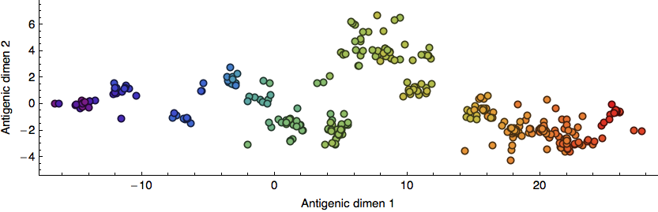

# Integrating influenza antigenic dynamics with molecular evolution #

Trevor Bedford^1^, Marc A. %NL%
Suchard^2,3,4^, Philippe Lemey^5^, Gytis Dudas^1^, Colin Russell^6^, Derek Smith^6,7^, Andrew Rambaut^1,8^

^1^ Institute of Evolutionary Biology, University of Edinburgh, Edinburgh, UK
^2^ Department of Biomathematics, David Geffen School of Medicine at UCLA, University of California, Los Angeles CA, USA
^3^ Department of Human Genetics, David Geffen School of Medicine at UCLA, University of California, Los Angeles CA, USA
^4^ Department of Biostatistics, UCLA School of Public Health, University of California, Los Angeles CA, USA
^5^ Department of Microbiology and Immunology, Katholieke Universiteit Leuven, Leuven, Belgium
^6^ Department of Zoology, University of Cambridge, Cambridge, UK.
^7^ Department of Virology, Erasmus Medical Centre, Rotterdam, Netherlands.
^8^ Fogarty International Center, National Institutes of Health, Bethesda, MD, USA.

## Abstract ##

## Introduction ##

*Introduction focuses on vaccine selection to tie things together with the planned conclusion.*

Seasonal influenza infects between 10% and 20% of the human population every year, causing 250,000 to 500,000 deaths annually [@flufactsheet]. While individuals develop long-lasting immunity to particular influenza strains after infection, antigenic mutations to the influenza virus genome result in proteins that are recognized to a lesser degree by the human immune system, leaving individuals susceptible to future infection. The influenza virus population continually evolves in antigenic phenotype in a process known as antigenic drift. A large proportion of the disease burden of influenza stems from antigenic drift; it is why vaccines remain only transiently effective. A thorough understanding of the process of antigenic drift is essential to our efforts to control mortality and morbidity through the use of a seasonal influenza vaccine.

Adding a sentence to the beginning of the paragraph. %NL%
There are currently three major clades of influenza circulating within the human population: influenza A subtype H3N2, influenza A subtype H1N1 and influenza B. %NL%
Subtypes refer to the genes, hemagglutinin (H) and neuraminidase (N), that are primarily responsible for the antigenic character of a strain. %NL%
Currently, seasonal influenza is treated with a trivalent vaccine containing one strain of H3N2, one strain of H1N1 and one strain of influenza B. %NL%
The World Health Organization (WHO) Global Influenza Surveillance Network issues twice-yearly recommendations on which strains of influenza to use as vaccine strains in 9-12 month’s time, i.e. %NL%
a February recommendation for the Northern Hemisphere flu season and an August recommendation for the Southern Hemisphere flu season. %NL%
These recommendations are provided by a panel of experts after review of the available data.

Mutations to the HA1 region of the hemagglutinin (HA) protein are thought to drive the majority of antigenic drift in the influenza virus [@Nelson07NatRevGenet]. %NL%
Experimental characterization of antigenic phenotype is possible through the hemagglutination inhibition (HI) assay [@Hirst43], which measures the cross-reactivity of one virus strain to serum raised against another strain. %NL%
Sera from older strains react poorly with more recent viruses resulting in new strains having a transmission advantage over established strains. %NL%
The results of many HI assays across a multitude of virus strains can be combined to yield a two-dimensional map, representing antigenic similarity and distance as an easily visualized and quantified measure [@Smith04]. %NL%
The antigenic map of influenza A (H3N2) has shown largely linear movement of the influenza virus population since its introduction in 1968. %NL%
However, evolution of antigenic phenotype appears punctuated with periods of stasis interspersed by periods of more rapid innovation, while genetic evolution appears more continuous [@Smith04], suggesting that a relatively small number of genetic changes or combinations of genetic changes may drive changes in antigenic phenotype. %NL%
The process of antigenic drift results in the rapid turnover of the virus population. %NL%
Although mutation occurs rapidly, standing genetic diversity is low and phylogenetic analysis shows a characteristically 'spindly' tree with a single predominant trunk lineage and transitory side branches that persist for only 1-5 years [@Fitch97].

Previously, the antigenic and genetic patterns of influenza evolution have been analyzed essentially in isolation. %NL%
An antigenic map is constructed from a panel of HI measurements, and a phylogenetic tree is constructed from sequence data. %NL%
However, the opportunity for a combined approach exists as both the antigenic map and the phylogenetic tree often contain many of the same isolates. %NL%
Here, we implement a flexible Bayesian approach to jointly analyze the antigenic and genetic dynamics of the influenza virus population. %NL%
We apply this approach to investigate the dynamics of influenza A (H3N2), influenza A (H1N1) and influenza B. %NL%
*Brief conclusions.*

## Results ##

## Discussion ##

The MDS results show (Figure [mds])...

Here is a table (Table [mk])...

## Methods ##

### Genetic and antigenic data ###

We compiled an antigenic dataset for hemagglutination inhibition (HI) measurements for influenza A (H3N2) by combining data used in Hay et al. %NL%
[@Hay01], Smith et al. %NL%
[@Smith04], Russell et al. %NL%
[@Russell08], Barr et al. %NL%
[@Barr10] and Cox et al. %NL%
*WHO report*. %NL%
This combined dataset had 1651 influenza isolates (present as either virus or sera in HI comparisons) dating from 1968 to 2011. %NL%
However, the majority of isolates date from 2002 to 2007. %NL%
Because we are interested in longer-term antigenic evolution, we censored the data to have at most 20 strains per year, preferentially keeping those strains with more antigenic comparisons. %NL%
This censoring left 338 strains present as 320 viruses and 438 sera (replicate sera are often constructed from the same strain). %NL%
Across these viruses and sera, we observe 7240 HI measurements. %NL%
We queried the IRD [@IRD] and GISAID *CITE* sequence databases for HA nucleotide sequences based on strain names, e.g. %NL%
A/HongKong/1/1968, of these strains. %NL%
If a strain had multiple sequences in the databases we preferentially kept the IRD sequence and preferentially kept the longest sequence in IRD. %NL%
Sequences were aligned using MUSCLE v3.7 under default parameters [@MUSCLE].

Antigenic data for influenza A (H1N1) was collected from sources... %NL%
*ask Gytis*

### Bayesian multidimensional scaling ###

We follow Smith et al. %NL%
[@Smith04] and represent antigenic locations on a 2D antigenic map. %NL%
Through the hemagglutination inhibition (HI) assay, there exist measurements of the cross-reactivity of hemagglutinin (HA) from one virus strain to serum raised against another strain [@Hirst43]. %NL%
Thus, antigenic phenotype is measured through a series a pairwise comparisons $H_{ij}$, comparing virus from strain $i$ to sera from strain $j$. %NL%
Due to experimental constraints, the distance matrix $\mathbf{H}$ is sparse; most comparisons have not be made. %NL%
Our goal is to find an optimal projection of the high-dimensional distance matrix into a lower number of dimensions. %NL%
We conduct this projection using Bayesian multidimensional scaling (BMDS) [@Oh01] in which a probabilistic model is constructed to quantify the fit of a particular configuration of cartographic locations to the observed matrix HI measurements.

Let $\mathbf{X}_i \in \Re^{P}$ represent the cartographic location of strain $i$ for $i = 1,\ldots, N$. %NL%
Typically, $P = 2$, but higher or lower dimensions may better reflect the data. %NL%
 This gives set of distances between cartographic locations 

$$\delta_{ij} =  || \mathbf{X}_i - \mathbf{X}_i ||_2.$$

We define the antigenic distance between virus from strain $i$ and antisera from strain $j$

$$d_{ij} =  \max{ H_{ij} } + 
	\log_2 \left(   
		\frac{ H_{ij} }{ \max{ H_j } }
	\right).$$

and let the set $\cal I = \{ (i,j) : H_{ij} \mbox{ is measured} \}$. %NL%
The goal of multidimensional scaling (MDS) optimizes over $\mathbf{X}_1,\ldots,\mathbf{X}_N$ such that

$$\sum_{(i,j) \in \cal I} 
	\left(
		\delta_{ij} - d_{ij}
	\right)^2$$

is minimized. %NL%

A probabilistic interpretation reformulates the optimization as

$$d_{ij} \sim \mbox{Normal}( \delta_{ij}, \omega ) \times 1( d_{ij} > 0 ) \mbox{ for all } (i,j) \in \cal I$$

where $1 ( \cdot )$ is the indicator function for truncation. %NL%
The likelihood of the antigenic distance measures is proportional to

$$\omega^{m/2} \mbox{exp} \left[
- \frac{\omega \times SSR}{2} - \sum_{(i,j) \in \cal I} \log \Phi (\omega \times \delta_{ij})
\right],$$

where $m$ is the cardinality of $\cal I$, $SSR$ is the sum of the squared residuals and $\Phi(\cdot)$ is the standard normal CDF. %NL%
We consider the conjugate prior $\omega \sim \mbox{Gamma}(a, b)$, and assume a uniform prior over $\mathbf{X}$.

### Acknowledgments ###

### Funding ###

## Tables ##

### Table [mk] ###

Effect								Baseline	Side branch		Trunk		Ratio
--------							--------	-----------		-----		-------------------			
Mutation size (AG units)			0.60		0.79			1.58		1.99$\times$
Mutation rate (mut per year)		0.04		0.06			0.81		13.23$\times$	
Antigenic flux (AG units per year)	0.02		0.05			1.27		26.25$\times$	

: This is an example table.

## Figures ##

### Figure [mds] ###

\

__Antigenic locations of influenza H3N2 and H1N1.__ (A) and (B) Antigenic maps showing the mean posterior location of 338 strains of H3N2 influenza and 243 strains of H1N1 influenza. %NL%
 The map has been oriented so that the primary axis of variation lies along the $x$-axis (AG1), with the $y$-axis (AG2) orthogonal to this axis. %NL%
 (C) and (D) Antigenic location along the primary axis of variation (AG1) vs.\ year of virus isolation. %NL%
The dashed lines show the relationship of between time and AG1 with a slope of *XXX* for H3N2 and *XXX* for H1N1. %NL%
 (E) and (F) Antigenic location along the secondary axis of variation (AG2) vs.\ year of virus isolation. %NL%
Antigenic units represent two-fold dilutions of the HI assay, and strains have been colored based on year of isolation. %NL%
 *Decide whether to just show mean posterior or show distributions.*

## References ##

[mds]: #figure-mds
[mk]: #table-mk
